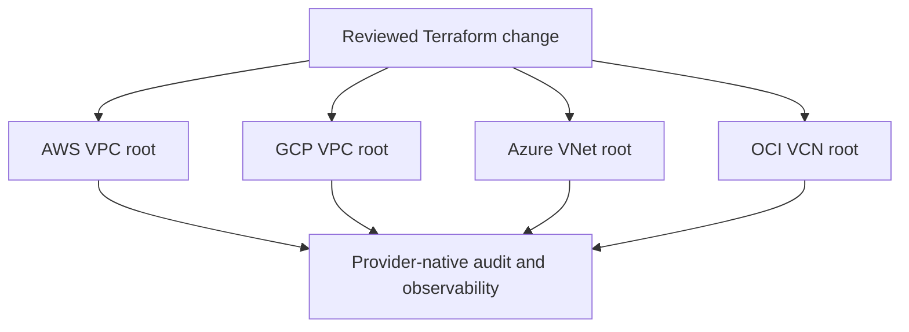

# Multi-Cloud Nexus Governance Framework

A **plan-first Terraform reference** for establishing small, independent network foundations across AWS, Google Cloud, Microsoft Azure, and Oracle Cloud Infrastructure (OCI). The project demonstrates consistent naming, CIDR planning, isolated provider roots, and non-production validation practices.

> This is not a one-click production landing zone. It intentionally avoids creating clusters, private connectivity, IAM organisations, or shared state backends because these require organisation-specific security and architecture decisions.

## Architecture



## Repository Layout

| Directory | Scope |
|---|---|
| `terraform/aws` | VPC reference with variable-driven region, CIDR, AZs, and tags. |
| `terraform/gcp` | Custom VPC and regional subnet reference. |
| `terraform/azure` | Resource group, VNet, and workload subnet reference. |
| `terraform/oci` | VCN reference with compartment and region inputs. |

## Plan Safely

Each provider root has a `terraform.tfvars.example` file. Copy it to `terraform.tfvars`, use a disposable environment, then run:

```bash
cd terraform/<provider>
terraform fmt -check -recursive
terraform init -backend=false
terraform validate
terraform plan
```

Use a remote encrypted state backend, locking where supported, short-lived identities, peer-reviewed CI plans, and organisation-specific policy checks before applying any production infrastructure. See [`docs/PROJECT_STATUS.md`](docs/PROJECT_STATUS.md) for scope and safety notes.
