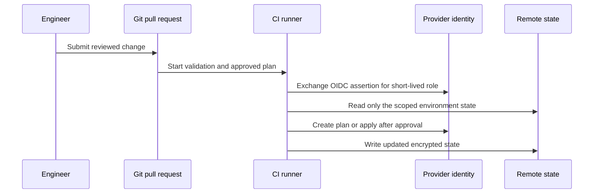

# State and Identity Design

The provider roots in this repository are intentionally independent. A production implementation should preserve that boundary in Terraform state and identity design.

## State scope

| Scope | Recommended state boundary | Why |
|---|---|---|
| Provider | Separate AWS, GCP, Azure, and OCI state. | A provider outage or credential issue should not block unrelated cloud changes. |
| Environment | Separate sandbox, development, and production state. | Limits blast radius and supports independent approvals. |
| Domain | Split networking, identity, shared services, and workload state as the platform grows. | Avoids one oversized plan and reduces permissions required by each pipeline. |

Use encrypted remote state and locking where the selected backend supports it. Do not commit state files, plan files containing sensitive values, cloud credentials, or provider-generated configuration.

## CI identity flow

A local administrator identity is useful only for a documented break-glass procedure. Routine changes should use short-lived CI identities with provider- and environment-specific roles.
